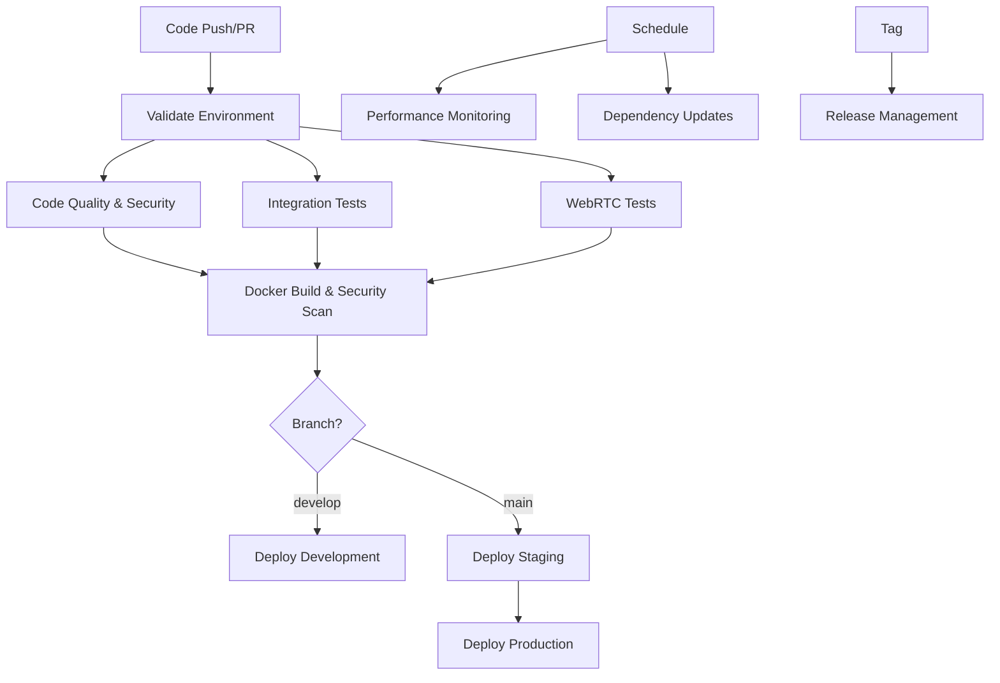

# 🚀 Seminote Backend CI/CD Pipeline

This directory contains the comprehensive CI/CD pipeline for the Seminote Piano Learning Platform backend services.

## 📋 Pipeline Overview

The CI/CD pipeline is designed to support the **speed-adaptive hybrid architecture** of the Seminote platform, ensuring high-quality, secure, and performant backend services.

### 🏗️ Pipeline Architecture



## 🔧 Workflow Files

### 1. 🚀 **ci-cd-pipeline.yml** - Main CI/CD Pipeline
**Triggers**: Push, Pull Request, Manual
**Purpose**: Core development and deployment pipeline

#### **Jobs**:
- **🔍 validate-environment**: Validates development environment setup
- **🔍 code-quality**: Code quality checks, security scans, test execution
- **🧪 integration-tests**: Comprehensive integration testing with databases
- **🌐 webrtc-tests**: WebRTC functionality and performance testing
- **🐳 docker-build**: Container building and security scanning
- **🚀 deploy-development**: Automated deployment to development environment
- **🎭 deploy-staging**: Deployment to staging environment
- **🌟 deploy-production**: Production deployment with approval gates

#### **Key Features**:
- ✅ **Multi-language support**: Java 21, Node.js 18, Python 3.9
- ✅ **Database testing**: PostgreSQL 16, Redis 7.4, MongoDB 7
- ✅ **Security scanning**: Dependency checks, container security
- ✅ **Performance validation**: Automated performance benchmarks
- ✅ **WebRTC testing**: Real-time communication validation
- ✅ **Environment-specific deployments**: Dev, staging, production

### 2. 📦 **dependency-updates.yml** - Dependency Management
**Triggers**: Weekly schedule (Mondays 9 AM UTC), Manual
**Purpose**: Automated dependency updates and security monitoring

#### **Jobs**:
- **🔒 security-audit**: Comprehensive security vulnerability scanning
- **📦 dependency-updates**: Automated dependency updates with testing
- **📊 version-monitoring**: Track latest versions of key dependencies
- **🧹 cleanup**: Clean up old workflow runs and artifacts

#### **Key Features**:
- ✅ **Automated security updates**: Critical vulnerability fixes
- ✅ **Version tracking**: Monitor latest stable versions
- ✅ **Automated PRs**: Create pull requests for dependency updates
- ✅ **Multi-ecosystem**: Java/Gradle, Node.js/npm, Python/pip
- ✅ **Testing validation**: Ensure updates don't break functionality

### 3. 📈 **performance-monitoring.yml** - Performance Testing
**Triggers**: Daily schedule (2 AM UTC), Manual
**Purpose**: Continuous performance monitoring and benchmarking

#### **Jobs**:
- **🗄️ database-performance**: Database performance benchmarking
- **🌐 webrtc-performance**: WebRTC latency and throughput testing
- **🔌 api-performance**: API response time and load testing
- **📊 performance-summary**: Comprehensive performance reporting

#### **Key Features**:
- ✅ **Database benchmarks**: PostgreSQL, Redis, MongoDB performance
- ✅ **WebRTC metrics**: Latency <5ms, throughput >1Mbps
- ✅ **API performance**: Response time <100ms, >1000 RPS
- ✅ **Seminote-specific**: Piano note detection, real-time feedback
- ✅ **Performance tracking**: Historical performance data

### 4. 🚀 **release-management.yml** - Release Automation
**Triggers**: Git tags (v*.*.*), Manual
**Purpose**: Automated release creation and deployment

#### **Jobs**:
- **🔍 validate-release**: Comprehensive release validation
- **📦 build-release-artifacts**: Build and package release artifacts
- **🏷️ create-release**: Create GitHub release with notes
- **🚀 deploy-release**: Production deployment for releases
- **🧹 cleanup-old-releases**: Clean up old release artifacts

#### **Key Features**:
- ✅ **Semantic versioning**: Automated version management
- ✅ **Release validation**: Full test suite before release
- ✅ **Artifact management**: Docker images, JAR files, documentation
- ✅ **Release notes**: Automated changelog generation
- ✅ **Production deployment**: Blue-green deployment strategy

## 🎯 Performance Targets

### 📊 **Database Performance**
- **PostgreSQL**: Insert 1000 records <2s, Query response <50ms
- **Redis**: 1000 operations <1s, Get/Set latency <1ms
- **MongoDB**: Insert 1000 documents <3s, Find operations <100ms

### 🌐 **WebRTC Performance**
- **Audio Latency**: <5ms for real-time piano feedback
- **Connection Setup**: <2s for initial WebRTC connection
- **Throughput**: >1Mbps sustained, >64kbps audio bitrate
- **Reliability**: >99% connection success rate

### 🔌 **API Performance**
- **Response Time**: <100ms average, <200ms 95th percentile
- **Throughput**: >1000 requests/second sustained
- **Success Rate**: >99.9% for all API endpoints
- **Concurrent Users**: >100 simultaneous connections

### 🎹 **Seminote-Specific Metrics**
- **Piano Note Detection**: <10ms processing latency
- **Real-time Feedback**: <20ms end-to-end delay
- **Speed-Adaptive Processing**: <50ms edge processing handoff

## 🔒 Security & Quality Gates

### **Security Scanning**
- ✅ **Dependency vulnerabilities**: OWASP dependency check
- ✅ **Container security**: Trivy security scanning
- ✅ **Code quality**: SonarQube analysis (when configured)
- ✅ **License compliance**: Automated license checking

### **Quality Gates**
- ✅ **Test coverage**: >90% code coverage required
- ✅ **Build success**: All services must build successfully
- ✅ **Integration tests**: All integration tests must pass
- ✅ **Performance tests**: Performance targets must be met
- ✅ **Security scan**: No high/critical vulnerabilities allowed

## 🌍 Environment Strategy

### **Development Environment**
- **Trigger**: Push to `develop` branch or feature branches
- **Purpose**: Continuous integration and early testing
- **Deployment**: Automated deployment after successful tests
- **Database**: Shared development database with test data

### **Staging Environment**
- **Trigger**: Push to `main` branch
- **Purpose**: Pre-production validation and user acceptance testing
- **Deployment**: Automated deployment with smoke tests
- **Database**: Production-like data with anonymization

### **Production Environment**
- **Trigger**: Manual approval or release tags
- **Purpose**: Live production environment
- **Deployment**: Blue-green deployment with rollback capability
- **Database**: Production database with full backup strategy

## 📊 Monitoring & Observability

### **Pipeline Monitoring**
- ✅ **Build status**: Real-time build status tracking
- ✅ **Test results**: Comprehensive test reporting
- ✅ **Performance metrics**: Historical performance tracking
- ✅ **Security alerts**: Automated vulnerability notifications

### **Application Monitoring**
- ✅ **Health checks**: Automated service health monitoring
- ✅ **Performance metrics**: Response time, throughput, error rates
- ✅ **Business metrics**: Piano learning session metrics
- ✅ **Infrastructure metrics**: Database, cache, message queue health

## 🔧 Configuration

### **Environment Variables**
Key environment variables used across workflows:

```yaml
JAVA_VERSION: '21'          # Java LTS version
NODE_VERSION: '18'          # Node.js LTS version  
PYTHON_VERSION: '3.9'      # Python version
REGISTRY: ghcr.io           # Container registry
IMAGE_NAME: ${{ github.repository }}  # Image naming
```

### **Secrets Required**
- `GITHUB_TOKEN`: Automatically provided by GitHub
- Additional secrets for external services (when configured):
  - `SONAR_TOKEN`: SonarQube integration
  - `SLACK_WEBHOOK`: Notification integration
  - `AWS_ACCESS_KEY_ID`: AWS deployment (if used)

## 🚀 Getting Started

### **For Developers**
1. **Push code** to feature branch → Triggers validation pipeline
2. **Create PR** to develop → Triggers full CI pipeline
3. **Merge to develop** → Deploys to development environment
4. **Merge to main** → Deploys to staging environment

### **For Releases**
1. **Create tag** with semantic version (e.g., `v1.0.0`)
2. **Release pipeline** automatically validates and creates release
3. **Manual approval** required for production deployment
4. **Monitoring** tracks post-deployment health

### **For Maintenance**
- **Weekly dependency updates** run automatically
- **Daily performance monitoring** tracks system health
- **Security scans** run on every build
- **Cleanup jobs** manage artifact retention

## 📚 Documentation

- **[Development Setup](../DEVELOPMENT_SETUP.md)**: Local development environment
- **[Latest Versions](../LATEST_VERSIONS.md)**: Technology version tracking
- **[Task Specifications](../tasks/)**: Detailed implementation guides
- **[Scripts](../scripts/)**: Automation and utility scripts

---

**🎹 Ready to build the future of piano education with robust CI/CD! 🚀**
