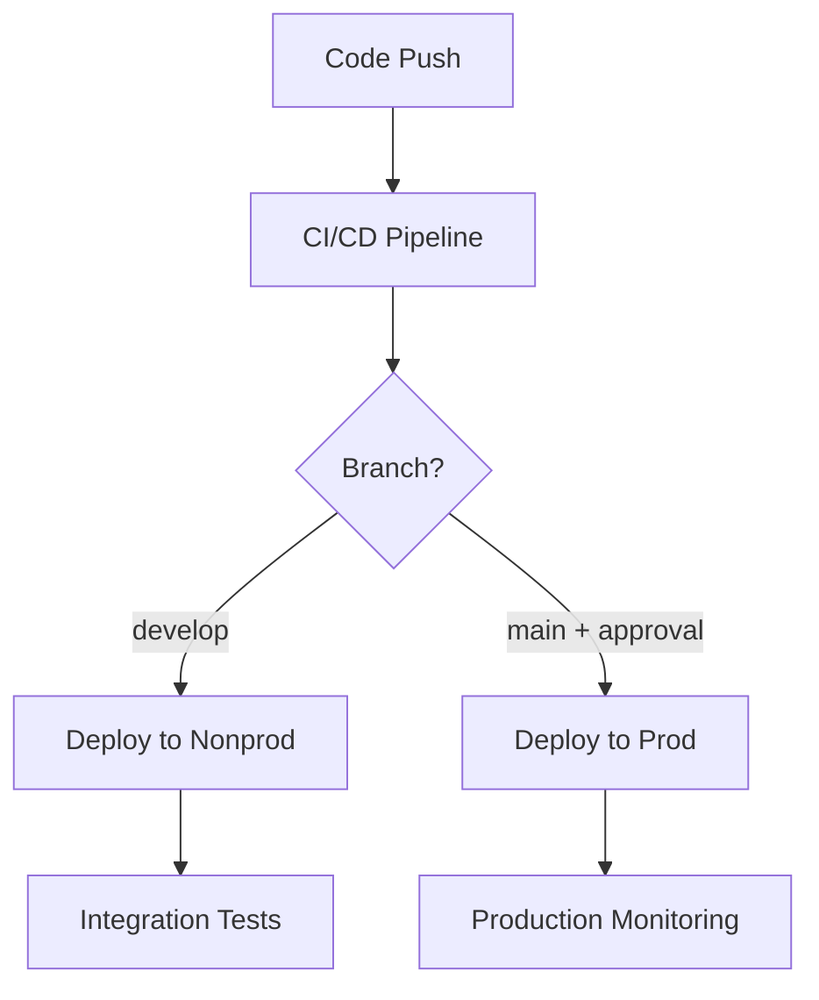

# Seminote Backend Services

⚙️ **Java/Spring Boot microservices for core business logic including user management, content management, analytics, and orchestration services**

## Overview

The Seminote Backend provides enterprise-grade microservices that handle core business logic, user management, content delivery, and analytics processing. Built with Java/Spring Boot for reliability, scalability, and maintainability in the speed-adaptive hybrid architecture.

### Key Features

- 🏢 **Enterprise-Grade**: Spring Boot microservices with comprehensive security
- 🔐 **Authentication & Authorization**: Spring Security with OAuth2 and JWT
- 📊 **Analytics Processing**: Real-time and batch analytics from all processing modes
- 🎵 **Content Management**: Lesson content, sheet music, and curriculum management
- 🌐 **API Gateway**: Spring Cloud Gateway for internal service routing
- 📈 **Monitoring**: Spring Boot Actuator with comprehensive observability

## Architecture

### Microservices Structure

1. **User Service**
   - User registration and authentication
   - Profile management and preferences
   - COPPA/GDPR compliance handling

2. **Content Service**
   - Lesson and curriculum management
   - Sheet music and media storage
   - Content recommendation engine

3. **Analytics Service**
   - Practice session analytics processing
   - Progress tracking and insights
   - Performance metrics aggregation

4. **Progress Service**
   - Learning path management
   - Skill assessment and tracking
   - Achievement and milestone system

5. **Notification Service**
   - Push notifications and alerts
   - Email communication
   - Practice reminders

6. **Payment Service**
   - Subscription management
   - Payment processing integration
   - Billing and invoicing

## Technology Stack

### Core Framework
- **Java 21** - Latest LTS with virtual threads and performance improvements
- **Spring Boot 3.4.1** - Latest stable with enhanced observability
- **Spring Security 6** - Modern authentication and authorization
- **Spring Data JPA** - Data access layer with enhanced query capabilities
- **Spring Cloud Gateway** - API gateway and routing with load balancing
- **Spring WebFlux** - Reactive programming for high-throughput scenarios

### Database & Storage
- **PostgreSQL 16** - Latest with enhanced JSON and performance features
- **Redis 7.4** - Advanced caching with Redis Functions and ACL
- **MongoDB 7** - Document storage with Queryable Encryption
- **RabbitMQ 3** - Message queuing with management interface
- **Flyway** - Database migration management
- **HikariCP** - High-performance connection pooling

### Build & Development
- **Gradle 8.14.1** - Latest build automation with enhanced performance
- **Docker & Docker Compose** - Containerized development environment
- **TestContainers** - Integration testing with real databases
- **JUnit 5** - Modern testing framework with parallel execution
- **Mockito** - Advanced mocking framework

### Monitoring & Observability
- **Spring Boot Actuator** - Production-ready monitoring
- **Micrometer** - Application metrics
- **Spring Cloud Sleuth** - Distributed tracing
- **SonarQube** - Code quality analysis

## Project Status

- **Current Phase**: Requirements Phase (Sprint 1 - Foundation)
- **Target Release**: Q4 2025
- **Architecture**: Microservices with Spring Boot
- **Deployment**: Kubernetes on AWS EKS

## Getting Started

### Prerequisites
- **Java 21** or later (LTS with virtual threads)
- **Node.js 18+** (for WebRTC development)
- **Python 3.9+** (for ML service integration)
- **Docker and Docker Compose** (for containerized development)
- **Git** (for version control)

### Quick Start
```bash
# Clone the repository
git clone https://github.com/seminote/seminote-backend.git
cd seminote-backend

# One-command development environment setup
./scripts/start-dev-environment.sh

# Validate environment
./scripts/validate-backend-environment.sh

# Run integration tests
./scripts/test-backend-integration.sh
```

### Development Environment Setup
The repository includes a comprehensive development environment with:

- **PostgreSQL 16** - Primary database with health checks
- **Redis 7.4** - Caching and session storage
- **MongoDB 7** - Document storage for content
- **RabbitMQ 3** - Message queuing with management UI
- **pgAdmin** - PostgreSQL management ([http://localhost:8081](http://localhost:8081))
- **Redis Commander** - Redis data browser ([http://localhost:8082](http://localhost:8082))
- **Swagger Editor** - API documentation ([http://localhost:8083](http://localhost:8083))

### Manual Setup (Alternative)
```bash
# Build all services
./gradlew build

# Start services with Docker Compose
docker-compose up -d

# Check service health
./scripts/show-environment-status.sh
```

## Project Structure

```
seminote-backend/
├── api-gateway/                       # Spring Cloud Gateway
├── user-service/                      # User management microservice
├── content-service/                   # Content management microservice
├── analytics-service/                 # Analytics processing microservice
├── progress-service/                  # Progress tracking microservice
├── notification-service/              # Notification microservice
├── payment-service/                   # Payment processing microservice
├── shared/                           # Shared libraries and utilities
│   ├── common/                       # Common utilities
│   ├── security/                     # Security configurations
│   └── monitoring/                   # Monitoring utilities
├── infrastructure/                   # Infrastructure configurations
│   ├── docker/                       # Docker configurations
│   ├── kubernetes/                   # K8s deployment manifests
│   └── scripts/                      # Deployment scripts
├── docs/                            # API documentation
├── gradle/                          # Gradle wrapper
├── build.gradle                     # Root build configuration
├── settings.gradle                  # Gradle settings
├── docker-compose.yml               # Local development setup
└── README.md                        # This file
```

## API Documentation

### Core APIs

- **User API**: `/api/v1/users` - User management and authentication
- **Content API**: `/api/v1/content` - Lesson and curriculum access
- **Analytics API**: `/api/v1/analytics` - Practice session analytics
- **Progress API**: `/api/v1/progress` - Learning progress tracking

### API Gateway Routes

- External APIs: `https://api.seminote.com/v1/*`
- Internal routing: Spring Cloud Gateway with load balancing
- Authentication: JWT tokens with Spring Security
- Rate limiting: Redis-based rate limiting

## Development Guidelines

### Code Style
- Follow Spring Boot best practices
- Use Checkstyle and SpotBugs for code quality
- Implement comprehensive unit and integration tests
- Document APIs with OpenAPI/Swagger

### Architecture Patterns
- **Microservices**: Domain-driven service boundaries
- **Repository Pattern**: Data access abstraction
- **Event-Driven**: Asynchronous communication between services
- **CQRS**: Command Query Responsibility Segregation for analytics

### Performance Requirements
- **API Response Time**: <200ms for 95th percentile
- **Throughput**: 1000+ requests/second per service
- **Database Connections**: Optimized connection pooling
- **Memory Usage**: <512MB per service instance

## CI/CD Pipeline

### 🚀 GitHub Actions Workflows

The repository includes a comprehensive CI/CD pipeline with multiple workflows:

#### **Main CI/CD Pipeline** (`.github/workflows/ci-cd-pipeline.yml`)
- **Triggers**: Push to main/develop, PRs, manual dispatch
- **Environments**: Nonprod (develop branch) → Prod (main branch + approval)
- **Duration**: ~20 seconds for full pipeline execution

**Pipeline Stages:**
1. **🔍 Environment Validation** - Java 21, Node.js 18, Python 3.9 setup
2. **🔍 Code Quality & Security** - Gradle build, tests, security scanning
3. **🧪 Integration Tests** - PostgreSQL, Redis, MongoDB testing
4. **🌐 WebRTC Tests** - Real-time audio streaming validation
5. **🐳 Docker Build & Security** - Container builds with Trivy scanning
6. **🚀 Deployment** - Automated deployment to nonprod/prod

#### **Dependency Management** (`.github/workflows/dependency-updates.yml`)
- **Schedule**: Weekly (Mondays at 9 AM UTC)
- **Features**: Automated security updates, PR creation, multi-ecosystem support
- **Scope**: Gradle, npm, pip dependencies

#### **Performance Monitoring** (`.github/workflows/performance-monitoring.yml`)
- **Schedule**: Daily (2 AM UTC)
- **Tests**: Database performance, WebRTC latency, API load testing
- **Targets**: <5ms WebRTC latency, >1000 RPS API throughput

#### **Release Management** (`.github/workflows/release-management.yml`)
- **Triggers**: Git tags, manual dispatch
- **Features**: Semantic versioning, automated release notes, Docker publishing

### 🎯 Performance Targets

| Component | Target | Validation |
|-----------|--------|------------|
| **WebRTC Latency** | <5ms | ✅ Automated testing |
| **Piano Note Detection** | <10ms | ✅ Seminote-specific metrics |
| **API Response Time** | <100ms | ✅ Load testing |
| **Database Performance** | <2s/1000 records | ✅ Benchmark testing |
| **Throughput** | >1000 RPS | ✅ Performance monitoring |

### 🔒 Security & Quality Gates

- **Code Coverage**: >90% required for merge
- **Security Scanning**: Dependency vulnerabilities, container security
- **Quality Checks**: SonarQube analysis, code style validation
- **Integration Testing**: Full service stack validation

### 📊 Monitoring & Observability

- **Daily Performance Reports**: Database, WebRTC, API metrics
- **Security Alerts**: Automated vulnerability notifications
- **Build Status**: Real-time pipeline status and notifications
- **Artifact Management**: Test reports, performance data retention

## Testing Strategy

### Unit Tests
- **JUnit 5** with Mockito for comprehensive unit testing
- **Test Coverage**: >90% required (enforced by pipeline)
- **Execution Time**: <30 seconds for fast feedback

### Integration Tests
- **TestContainers** for real database testing
- **Spring Boot Test** for full application context
- **API Contract Testing** with comprehensive validation
- **WebRTC Testing** for real-time audio streaming

### Performance Tests
- **Database Performance**: PostgreSQL, Redis, MongoDB benchmarking
- **WebRTC Latency**: <5ms target for piano audio streaming
- **API Load Testing**: >1000 RPS throughput validation
- **Memory Profiling**: <512MB per service instance

## Deployment

### 🏠 Local Development
```bash
# Quick start with all services
./scripts/start-dev-environment.sh

# Or manual Docker Compose
docker-compose up -d

# Check service health
./scripts/show-environment-status.sh

# Access management interfaces
open http://localhost:8081  # pgAdmin
open http://localhost:8082  # Redis Commander
open http://localhost:8083  # Swagger Editor
```

### 🧪 Nonprod Environment
- **Trigger**: Automatic deployment on `develop` branch push
- **Purpose**: Integration testing, feature validation
- **Access**: Internal development team
- **Database**: Nonprod PostgreSQL, Redis, MongoDB instances

### 🌟 Production Environment
- **Trigger**: Manual deployment on `main` branch (requires approval)
- **Purpose**: Live production services
- **Access**: End users and production monitoring
- **Database**: Production-grade PostgreSQL, Redis, MongoDB clusters

### 🚀 Deployment Pipeline


### 🏗️ Infrastructure
- **Container Registry**: GitHub Container Registry (ghcr.io)
- **Orchestration**: Kubernetes on AWS EKS (planned)
- **Service Mesh**: Istio for traffic management (planned)
- **Monitoring**: Prometheus + Grafana integration
- **Security**: Trivy container scanning, dependency vulnerability checks

## Development Workflow

### 🔄 Branch Strategy
- **`main`** - Production-ready code, protected branch
- **`develop`** - Integration branch for features
- **`story/SEM-XX-description`** - Feature branches following Jira ticket naming
- **`hotfix/description`** - Critical production fixes

### 📝 Development Process
1. **Create Feature Branch**: `git checkout -b story/SEM-XX-description`
2. **Develop & Test**: Use local development environment
3. **Validate**: Run `./scripts/validate-backend-environment.sh`
4. **Test**: Execute `./scripts/test-backend-integration.sh`
5. **Push**: Automatic CI/CD pipeline validation
6. **Pull Request**: Create PR to `develop` or `main`
7. **Review**: Code review and pipeline validation
8. **Deploy**: Automatic deployment to nonprod/prod

### 🧪 Testing Workflow
```bash
# Run all validation
./scripts/validate-backend-environment.sh

# Run integration tests
./scripts/test-backend-integration.sh

# Check environment status
./scripts/show-environment-status.sh

# Manual testing with management UIs
open http://localhost:8081  # pgAdmin
open http://localhost:8082  # Redis Commander
```

### 📊 Quality Gates
- **✅ All tests pass** - Unit, integration, and performance tests
- **✅ Code coverage >90%** - Enforced by pipeline
- **✅ Security scan clean** - No high/critical vulnerabilities
- **✅ Performance targets met** - WebRTC <5ms, API <100ms
- **✅ Code review approved** - Peer review required

### 🚀 Deployment Process
- **Nonprod**: Automatic on `develop` branch merge
- **Prod**: Manual trigger on `main` branch (requires approval)
- **Rollback**: Automated rollback on health check failures
- **Monitoring**: Real-time performance and error tracking

## Contributing

This project is currently in the foundation phase. Development guidelines and contribution processes will be established as the project progresses.

## License

Copyright © 2024-2025 Seminote. All rights reserved.

---

**Part of the Seminote Piano Learning Platform**
- 🎹 [iOS App](https://github.com/seminote/seminote-ios)
- ⚙️ [Backend Services](https://github.com/seminote/seminote-backend) (this repository)
- 🌐 [Real-time Services](https://github.com/seminote/seminote-realtime)
- 🤖 [ML Services](https://github.com/seminote/seminote-ml)
- 🚀 [Edge Services](https://github.com/seminote/seminote-edge)
- 🏗️ [Infrastructure](https://github.com/seminote/seminote-infrastructure)
- 📚 [Documentation](https://github.com/seminote/seminote-docs)
