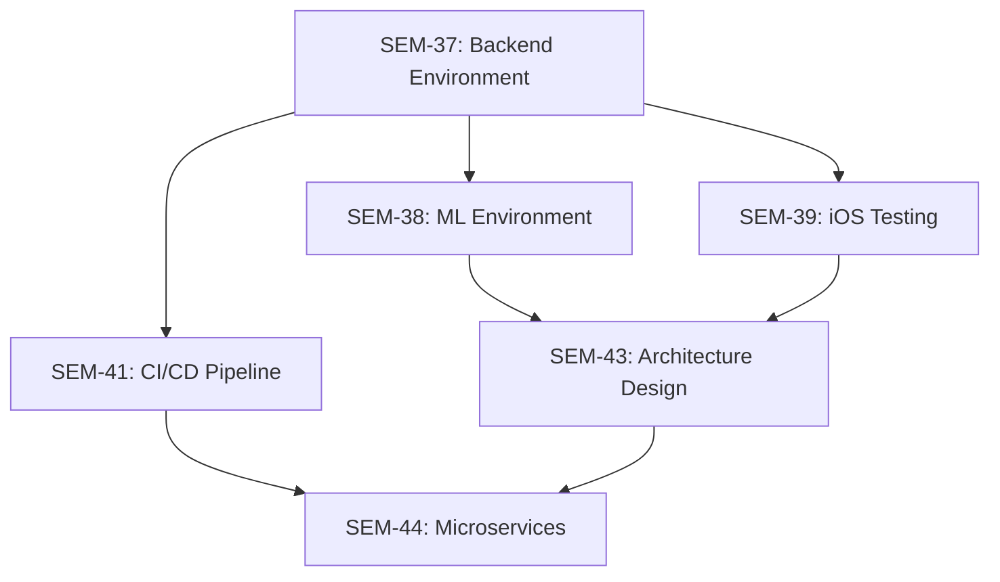

# 📋 Seminote Backend Tasks Directory

## 🎯 Purpose

This directory contains comprehensive task specification files for Jira tickets related to the **Seminote Piano Learning Platform** backend development. Each file provides complete implementation guidance for AI agents or developers working independently without access to Jira or Confluence.

## 📁 Current Tasks

### ✅ Available Task Specifications

- **[SEM-37-backend-dev-environment-setup.md](./SEM-37-backend-dev-environment-setup.md)**: Complete backend development environment setup
  - **Status**: Ready for implementation
  - **Scope**: Node.js, Python, Java, Docker, Kubernetes, WebRTC, databases
  - **Target**: AI agents with Git repository access only
  - **Estimated Effort**: 2-3 days

### 🔄 Planned Task Specifications

- **SEM-38-ml-dev-environment-setup.md**: ML development environment (TensorFlow, PyTorch, Core ML Tools)
- **SEM-39-ios-testing-framework.md**: Enhanced iOS testing framework setup
- **SEM-40-git-repository-structure.md**: Git repository structure standardization
- **SEM-41-cicd-pipeline-setup.md**: CI/CD pipeline implementation
- **SEM-42-documentation-platform.md**: Documentation platform setup

## 🏗️ File Structure Standards

Each task specification file follows this comprehensive structure:

### 📋 Required Sections

1. **Jira Ticket Information**
   - Complete ticket metadata (ID, title, description, acceptance criteria)
   - Parent epic context and dependencies

2. **Seminote Project Context**
   - Project overview and architecture role
   - Integration points with other components
   - Speed-adaptive hybrid architecture requirements

3. **Technical Implementation Guide**
   - Step-by-step installation instructions
   - Platform-specific commands (macOS, Ubuntu, Windows)
   - Configuration examples and code samples

4. **Validation & Testing Procedures**
   - Automated validation scripts
   - Integration tests and performance benchmarks
   - Success criteria verification

5. **Documentation & Configuration**
   - Environment variables and configuration files
   - IDE setup recommendations
   - Development workflow guidelines

6. **Troubleshooting & Next Steps**
   - Common issues and solutions
   - Integration with other tasks
   - Clear success deliverables

## 🎯 Target Audience

These task specifications are designed for:

- **AI Agents**: Complete autonomous implementation with Git repository access only
- **Remote Developers**: Independent work without Jira/Confluence access
- **New Team Members**: Comprehensive onboarding and setup guidance
- **DevOps Engineers**: Infrastructure and environment setup

## 🔗 Integration Context

### 🏛️ Seminote Architecture Overview

The backend services support the **speed-adaptive hybrid architecture**:

- **Local iOS Processing** (>120 BPM): Ultra-low latency feedback
- **Edge Computing** (60-120 BPM): Detailed analysis with moderate latency
- **Cloud Services** (<60 BPM): Comprehensive learning analytics

### 🔄 Task Dependencies

## 📊 Quality Standards

### ✅ Validation Requirements

Each task specification must include:

- [ ] Complete Jira ticket information extracted
- [ ] Relevant Confluence documentation integrated
- [ ] Step-by-step implementation instructions
- [ ] Platform-specific installation commands
- [ ] Automated validation scripts
- [ ] Integration testing procedures
- [ ] Troubleshooting guide
- [ ] Clear success criteria
- [ ] Next steps and dependencies

### 🧪 Testing Standards

- **Validation Scripts**: Automated environment verification
- **Integration Tests**: Cross-component functionality testing
- **Performance Benchmarks**: Latency and throughput validation
- **Error Handling**: Comprehensive troubleshooting procedures

## 🚀 Usage Instructions

### For AI Agents

1. **Read Complete File**: Process entire task specification
2. **Verify Prerequisites**: Check system requirements and dependencies
3. **Execute Step-by-Step**: Follow implementation guide sequentially
4. **Run Validation**: Execute all testing and validation procedures
5. **Document Results**: Record completion status and any issues
6. **Prepare Integration**: Ready for dependent tasks

### For Developers

1. **Review Context**: Understand Seminote project architecture
2. **Check Dependencies**: Verify prerequisite tasks completed
3. **Follow Guide**: Implement using provided instructions
4. **Validate Setup**: Run all validation scripts
5. **Test Integration**: Verify component interactions
6. **Update Documentation**: Record any environment-specific notes

## 📈 Success Metrics

- **Environment Readiness**: All validation scripts pass
- **Integration Capability**: Components communicate successfully
- **Performance Targets**: Latency and throughput requirements met
- **Documentation Quality**: Complete setup and troubleshooting guides
- **Team Readiness**: New developers can follow instructions independently

## 🔄 Continuous Improvement

Task specifications are living documents that should be updated based on:

- **Implementation Feedback**: Issues encountered during setup
- **Environment Changes**: New tool versions or requirements
- **Architecture Evolution**: Updates to Seminote platform design
- **Team Input**: Developer experience and suggestions

---

**🎹 Building the future of piano education through comprehensive task documentation!**
